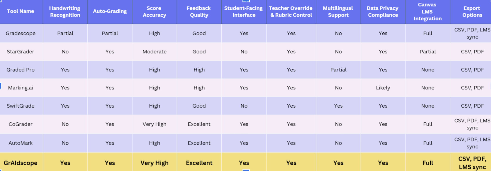

# 📚 grAIscope -- Gradescope Reimagined: AI-Powered Grading System

**Project Overview**  
Gradescope Reimagined is a revolutionary AI-powered grading platform designed to transform the way educators assess student work. In today’s fast-paced educational environment, teachers are often overwhelmed by the sheer volume of exams and assignments, spending countless hours on grading rather than focusing on instruction and student engagement. Meanwhile, students are left waiting anxiously for their results, sometimes enduring weeks before receiving meaningful feedback.
Gradescope Reimagined addresses these challenges head-on by automating the evaluation of free-response exams with unparalleled speed and precision. Teachers simply upload their answer key PDF, and students submit their completed exams through our secure platform. Leveraging advanced AI algorithms, our system analyzes each student’s submission, compares it against the teacher’s key, and generates comprehensive grades along with detailed, actionable feedback—all within minutes.
This intelligent platform not only dramatically reduces grading time, but it also ensures consistency and fairness across every submission. Educators can trust that every response is evaluated with the same rigorous standard, eliminating human error and subjective bias. For students, the result is immediate, transparent feedback that supports learning and improvement, fostering a more engaging and responsive educational experience.
For investors, Gradescope Reimagined represents a cutting-edge opportunity at the intersection of AI, EdTech, and workflow automation. By tackling one of the most time-consuming aspects of education—grading—our platform opens the door to scalable solutions that can be deployed across schools, universities, and large-scale online learning environments. With a focus on efficiency, accuracy, and student outcomes, Gradescope Reimagined is poised to redefine the future of assessment, empowering educators and enhancing the academic journey for students everywhere.

---

## Inspiration
We started this project after identifying major issues with OSU’s current grading platform, Gradescope.
- Firstly, It’s slow: TA and teachers have to manually grade questions, and in big classes, it takes 2 weeks to grade midterms.
- Secondly,it’s unreliable: Multiple issues been reported when gradescope doesn't get student tests, graded-tests lists, and other glitches. 


To address these problems, our team researched other grading solutions, comparing their features, strengths, and weaknesses and summarized them to this decision matrix. 
We used this analysis to design a better system to combine the efficiency of AI-based grading with higher reliability and accessibility for both instructors and students.


## 🧩 Features

- **Teacher Upload:** Teachers upload the answer key PDF for any exam.  
- **Student Submission:** Students upload their completed exam PDFs.  
- **AI Grading:** Automatically compares student answers with the teacher's key and produces:
  - Detailed scoring breakdowns (Completeness, Correctness, Simplification/Presentation)  
  - Overall exam score  
  - Feedback comments for each question  
- **Secure & Fast:** Uses API keys and efficient backend processing to handle multiple submissions.  
- **User-Friendly Frontend:** Intuitive interface for uploading files and viewing results.


## Design Process
**Gap Identification:**
The team analyzed existing graders and found most failed at handling handwritten text and relied on manual upload review.
The team also found some AI grading software are rated poorly due to steep learning curve for teachers. 
**Experimental Exploration:** 
Tested multiple approaches—OCR engines, custom AI scoring logic, and dataset preprocessing to evaluate accuracy gains.
The team brainstormed and communicated ideas for UI layout for both students and teachers to minimize learning curve.
**Implementation Actions:**
Integrated OpenAI API for semantic grading and Amazon S3 for scalable file storage.
Used React + Vite to improve frontend responsiveness.
Switched from self-hosted authentication to Google OAuth Login for security and simplicity.
Built a Flask + PostgreSQL backend with Nginx deployment to ensure fast, reliable service.
Outcome: The exploration directly improved usability, data flow, and OCR precision, producing a more accurate and efficient AI grader.


---
## Metrics



## 🛠 Technology Stack

### Backend
- **Web Server:** NGINX  
- **Cloud Storage:** Amazon S3  
- **Web Framework:** Flask  
- **Database:** PostgreSQL  
- **AI/ML Integration:** OpenAI GPT-5 API  

### Frontend
- **Frameworks/Libraries:** React, Vite  
- **Languages:** HTML, CSS, JavaScript  


---

## 🚀 Getting Started

### 1. Clone the repository
```bash
git clone https://github.com/25kgozon/HackOHIO25.git
cd HackOHIO25
